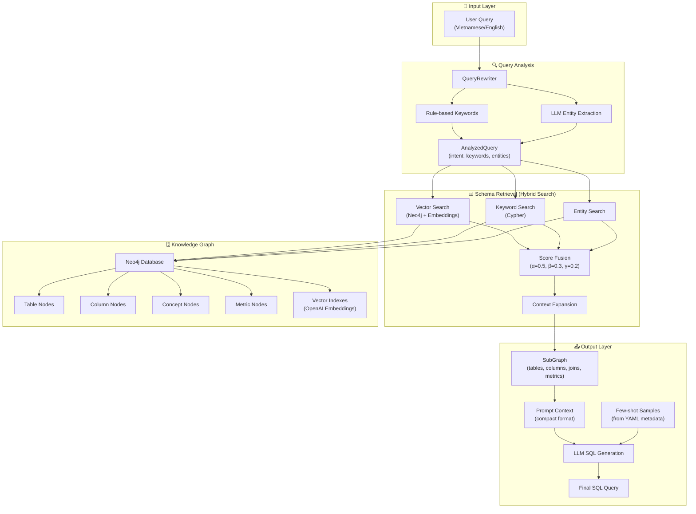
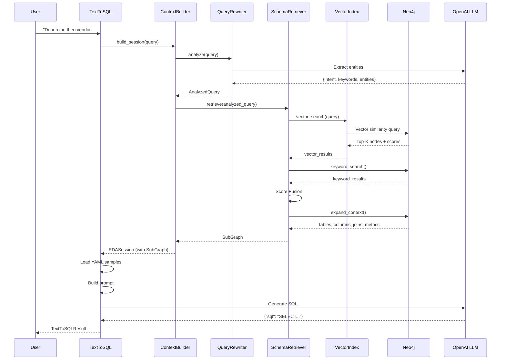

# Text-to-SQL Flow - Complete Documentation

Tài liệu chi tiết về luồng hoạt động của hệ thống Text-to-SQL trong EDA Agent.

---

## 🏗️ Architecture Overview



---

## 📁 File Structure

| Layer | File | Description |
|-------|------|-------------|
| **Embeddings** | `src/embeddings/openai_embedder.py` | OpenAI embedding API wrapper |
| **Embeddings** | `src/embeddings/text_builder.py` | Node → Text conversion for embedding |
| **Context Fusion** | `src/context_fusion/query_rewriter.py` | Query analysis + entity extraction |
| **Context Fusion** | `src/context_fusion/vector_index.py` | Neo4j vector index management |
| **Context Fusion** | `src/context_fusion/schema_retriever.py` | Hybrid search + SubGraph retrieval |
| **Context Fusion** | `src/context_fusion/models.py` | Data models (SubGraph, TableNode, etc.) |
| **Context Fusion** | `src/context_fusion/context_builder.py` | Session builder (entry point) |
| **MCP Tools** | `src/mcp/tools/text_to_sql.py` | Final SQL generation tool |

---

## 🔄 Detailed Flow

### **STEP 1: Query Analysis** (`QueryRewriter`)

Phân tích câu hỏi user để trích xuất thông tin:

```python
# Entry point
analyzed_query = await query_rewriter.analyze("Doanh thu theo vendor tháng 12")
```

#### 1.1 Intent Detection (Rule-based)

```python
INTENT_PATTERNS = {
    QueryIntent.DIAGNOSTIC: [r"tại sao", r"vì sao", r"nguyên nhân"],
    QueryIntent.COMPARATIVE: [r"so sánh", r"so với", r"versus"],
    QueryIntent.TREND: [r"xu hướng", r"biến động", r"trend"],
    QueryIntent.AGGREGATION: [r"tổng", r"trung bình", r"theo\s+\w+"],
}
```

#### 1.2 Keyword Extraction (Vietnamese → English Mapping)

```python
KEYWORD_MAPPINGS = {
    "doanh thu": ["revenue", "total_amount"],
    "đơn hàng": ["order", "orders"],
    "ngân hàng": ["bank", "bank_id"],
    "rạp": ["cinema", "vendor"],
    "phim": ["film", "movie"],
    # ... 30+ mappings
}
```

#### 1.3 Entity Extraction (LLM-enhanced)

LLM nhận vào query và trả về JSON:
```json
{
    "intent": "aggregation",
    "keywords": ["revenue", "vendor"],
    "entities": [
        {"text": "doanh thu", "type": "metric", "normalized": "total_revenue"},
        {"text": "vendor", "type": "table", "normalized": "vendor"}
    ]
}
```

#### Output: `AnalyzedQuery`

```python
@dataclass
class AnalyzedQuery:
    original_query: str
    intent: QueryIntent          # DIAGNOSTIC, AGGREGATION, etc.
    entities: list[ExtractedEntity]  # table, column, metric, concept
    keywords: list[str]          # English terms for Neo4j search
    time_range: dict | None      # {"month": "12", "year": "2024"}
```

---

### **STEP 2: Embedding & Vector Index**

#### 2.1 Embedding Model

```python
class OpenAIEmbedder:
    model = "text-embedding-3-small"  # Default from config
    dimensions = 1536  # Configurable
    
    def embed_text(self, text: str) -> List[float]:
        response = self.client.embeddings.create(model=self.model, input=text)
        return response.data[0].embedding
```

#### 2.2 Node Text Building

Mỗi node type có format text riêng để embed:

| Node Type | Format |
|-----------|--------|
| **Table** | `{table_name} \| {business_name} \| {description} \| {grain} \| tags: {tags}` |
| **Column** | `{table_name}.{column_name} \| {business_name} \| {description} \| semantics: {semantics}` |
| **Concept** | `{name} \| synonyms: {synonyms}` |
| **Metric** | `{name} \| {business_name} \| expression: {expression} \| base_table: {base_table}` |

**Example:**
```
orders | Bảng đơn hàng gốc | Lưu thông tin đơn đặt vé phim | 1 dòng = 1 đơn hàng | tags: fact order core
```

#### 2.3 Neo4j Vector Index

```cypher
-- Created for each node label
CREATE VECTOR INDEX text_to_sql_table IF NOT EXISTS
FOR (n:Table)
ON n.embedding
OPTIONS {
    indexConfig: {
        `vector.dimensions`: 1536,
        `vector.similarity_function`: 'cosine'
    }
}
```

---

### **STEP 3: Hybrid Search** (`SchemaRetriever`)

Kết hợp 3 tín hiệu để tìm tables liên quan:

```python
# Score weights
VECTOR_WEIGHT = 0.5   # α
KEYWORD_WEIGHT = 0.3  # β
ENTITY_WEIGHT = 0.2   # γ

final_score = α * vector_score + β * keyword_score + γ * entity_score
```

#### 3.1 Vector Search (α = 0.5)

```python
# Query: "Doanh thu theo vendor"
query_embedding = embedder.embed_text(query)

results = neo4j.query("""
    CALL db.index.vector.queryNodes('text_to_sql_table', 10, $embedding)
    YIELD node, score
    RETURN node.table_name, score
""", embedding=query_embedding)
```

#### 3.2 Keyword Search (β = 0.3)

Tìm trong Neo4j bằng Cypher text matching:

```cypher
MATCH (t:Table {domain: $domain})
OPTIONAL MATCH (t)-[:HAS_COLUMN]->(c:Column)
OPTIONAL MATCH (t)-[:HAS_CONCEPT]->(con:Concept)
WITH t, cols, cons, $keywords AS keywords
WHERE size([kw IN keywords WHERE 
    toLower(t.table_name) CONTAINS toLower(kw) OR
    toLower(t.business_name) CONTAINS toLower(kw) OR
    any(col IN cols WHERE toLower(col.column_name) CONTAINS toLower(kw))
]) > 0
RETURN t.table_name, match_count
```

#### 3.3 Entity Search (γ = 0.2)

Vector search với từng entity đã extract:

```python
for entity in entities[:5]:  # Top 5 entities
    results = vector_index.vector_search(entity.normalized_name, top_k=5)
    # Score weighted at 0.8x
```

#### 3.4 Score Fusion + Bonus

```python
for table in scored_tables.values():
    table.final_score = (
        0.5 * table.vector_score +
        0.3 * table.keyword_score +
        0.2 * table.entity_score
    )
    
    # Multi-source bonus
    if len(table.match_sources) >= 2:
        table.final_score *= 1.2
    if len(table.match_sources) >= 3:
        table.final_score *= 1.1
```

---

### **STEP 4: Context Expansion**

Từ top-K tables, mở rộng để lấy thêm context:

```python
def _expand_context(table_names, depth=2):
    # 1. Get table details
    tables = query("MATCH (t:Table) WHERE t.table_name IN $names ...")
    
    # 2. Get KEY columns only (PK + TIME)
    key_columns = query("""
        MATCH (t:Table)-[r:HAS_COLUMN]->(c:Column)
        WHERE t.table_name IN $names
          AND (r.primary_key = true OR r.time_column = true)
        RETURN ...
    """)
    
    # 3. Get vector-matched columns (from initial search)
    # 4. Get JOIN relationships
    # 5. Get FK relationships  
    # 6. Get METRICS
    
    return {tables, columns, joins, metrics}
```

---

### **STEP 5: SubGraph Construction**

Kết quả từ expansion được đóng gói vào `SubGraph`:

```python
@dataclass
class SubGraph:
    tables: list[TableNode]      # Full table metadata
    columns: list[ColumnNode]    # PK + TIME + vector-matched
    joins: list[JoinEdge]        # JOIN + FK relationships
    metrics: list[MetricNode]    # Related metrics
    concepts: list[ConceptNode]  # Business concepts
    
    # Pre-computed indexes for O(1) lookup
    _table_index: dict[str, TableNode]
    _columns_by_table: dict[str, list[ColumnNode]]
    _joins_by_table: dict[str, list[JoinEdge]]
```

**Key Methods:**
```python
sub_graph.get_table("orders")           # O(1) lookup
sub_graph.get_columns_for_table("orders")  # O(1)
sub_graph.get_joins_for_table("orders")    # O(1)
sub_graph.get_related_tables("orders")     # ["vendor", "bank"]
sub_graph.to_prompt_context(compact=True)  # For LLM prompt
```

---

### **STEP 6: Prompt Context Generation**

SubGraph được convert thành compact text cho LLM:

```python
def _to_compact_prompt(self) -> str:
    """
    Output example:
    
    ## Tables
    - orders: Bảng đơn hàng gốc
    - vendor: Thông tin vendor/đối tác
    
    ## Key Columns
    - orders: id[PK], created_date[T]
    - vendor: vendor_id[PK]
    
    ## Joins
    - orders→vendor: orders.vendor_id = vendor.vendor_id
    """
```

---

### **STEP 7: Few-shot Sample Loading**

Từ YAML metadata, load relevant sample queries:

```python
def _load_relevant_samples(table_names, prompt):
    for table_name in table_names:
        yaml_path = f"metadata/domains/{domain}/tables/{table_name}.yml"
        metadata = load_yaml(yaml_path)
        
        for sample in metadata["sample_queries"]:
            score = keyword_overlap_score(prompt, sample["description"])
            samples.append({
                "question": sample["description"],
                "sql": sample["sql"],
                "score": score,
            })
    
    # Return top 2 samples by score
    return sorted(samples, key=lambda x: x["score"])[:2]
```

**Output format:**
```
Examples:
Q1: Thống kê số SMS theo loại
A1: SELECT type, COUNT(*) AS total_sms FROM lakehouse.lh_vnfilm_v2.notify_sms GROUP BY type ORDER BY total_sms DESC
Q2: Lịch sử SMS của đơn hàng 1
A2: SELECT id, type, content, status, created_date FROM lakehouse.lh_vnfilm_v2.notify_sms WHERE order_id = 1 ORDER BY created_date DESC LIMIT 200
```

---

### **STEP 8: SQL Generation** (`TextToSQL`)

Final LLM call để sinh SQL:

#### System Prompt

```
You are a Trino SQL expert.
Generate a valid SELECT query using ONLY the provided schema.
Learn from the example queries provided.

TRINO RULES:
- Use FULL table names with catalog.schema.table format
- DATE functions: date_trunc('month', col), current_date
- Aggregates: SUM, COUNT, AVG, MIN, MAX
- Use table aliases
- End with semicolon

OUTPUT: Return ONLY valid JSON: {"sql": "SELECT ...;"}
```

#### User Prompt

```
Schema:
## Tables
- orders: Bảng đơn hàng gốc
- vendor: Thông tin vendor

## Key Columns
- orders: id[PK], created_date[T], vendor_id
- vendor: vendor_id[PK], vendor_name

## Joins
- orders→vendor: orders.vendor_id = vendor.vendor_id

Examples:
Q1: Tổng doanh thu theo vendor
A1: SELECT v.vendor_name, SUM(o.total_amount) ...

Q: Doanh thu theo vendor tháng 12
SQL:
```

#### Output Parsing

```python
def _parse_sql(self, content: str) -> str:
    # Parse JSON response
    result = json.loads(content)
    sql = result.get("sql", "").strip()
    
    # Validation
    if not sql.upper().startswith("SELECT"):
        return ""
    
    # Ensure semicolon
    if not sql.endswith(";"):
        sql += ";"
    
    return sql
```

---

## 📊 Data Flow Summary



---

## ⚠️ Current Limitations

| Issue | Impact | Solution |
|-------|--------|----------|
| **No sample_values** | WHERE conditions may use wrong values | Add `sample_values` to YAML + Column nodes |
| **Compact prompt** | Only PK + TIME columns shown | Consider showing all columns in detailed mode |
| **Few-shot limit** | Max 2 samples | May miss relevant patterns |
| **Vietnamese embedding** | OpenAI models may not capture Vietnamese semantics well | Consider multilingual embeddings |

---

## 🔧 Configuration

```python
# config.yaml
openai:
  model: "gpt-4o-mini"
  embedding_model: "text-embedding-3-small"
  
neo4j:
  uri: "bolt://localhost:7687"
  user: "neo4j"
  password: "..."

vector_index:
  index_name: "text_to_sql"
  dimensions: 1536
  similarity_function: "cosine"
  top_k: 10
```

---

## 📚 Related Commands

```bash
# Build Neo4j graph from YAML
python scripts/build_neo4j_graph.py --domain vnfilm_ticketing

# Index embeddings
python scripts/index_embeddings.py

# Test text-to-SQL
python scripts/test/test_text_to_sql.py
```
