# 📊 Báo Cáo Phân Tích Dữ Liệu

**Ngày tạo:** 16/12/2025 13:49:19

---

## 📋 Tóm Tắt Điều Hành

> **Câu hỏi:** Phân tích doanh thu 3 tháng 10, 11, 12

### Kết Quả Tổng Quan

| Chỉ số | Giá trị |
|--------|---------|
| Số vòng phân tích | 4 |
| Tổng giả thuyết | 6 |
| Đã xác thực | 5 |
| Bị bác bỏ | 3 |
| Biểu đồ tạo ra | 14 |

### Phát Hiện Quan Trọng Nhất

- ✅ Doanh thu cao nhất trong ba tháng là tháng 10 với tổng doanh thu 8.721 triệu VND.
- ✅ Doanh thu thấp nhất là tháng 12 với chỉ 3.034 triệu VND.
- ✅ Doanh thu từ vé chiếm phần lớn trong cấu trúc doanh thu mỗi tháng.

### Các Nguyên Nhân Đã Xác Thực

- 🎯 **- **Statement**: Doanh thu từ dịch vụ concession giảm đáng kể trong tháng 12 do **
- 🎯 **- **Statement**: Sự suy giảm số lượng đơn hàng trong tháng 12 có thể do giảm số **
- 🎯 **- **Statement**: Tháng 12 có thể bị ảnh hưởng bởi sự thay đổi trong hành vi tiêu**

---

## 🔍 Giai Đoạn 1: Khám Phá Dữ Liệu

*Giai đoạn này xây dựng bức tranh tổng quan về tình hình.*

### 📌 Phát Hiện Chính

- Doanh thu cao nhất trong ba tháng là tháng 10 với tổng doanh thu 8.721 triệu VND.
- Doanh thu thấp nhất là tháng 12 với chỉ 3.034 triệu VND.
- Doanh thu từ vé chiếm phần lớn trong cấu trúc doanh thu mỗi tháng.

### 📊 Số Liệu Tổng Quan

| Chỉ số | Giá trị |
|--------|---------|
| tong_doanh_thu | 20.255 triệu VND |
| thang_cao_nhat | Tháng 10 |
| thang_thap_nhat | Tháng 12 |
| tong_so_don_hang_thang_10 | 22 |
| tong_so_don_hang_thang_11 | 22 |
| tong_so_don_hang_thang_12 | 6 |

### 📈 Xu Hướng

- 📈 Doanh thu giảm 2.3% từ tháng 10 (8.721 triệu) sang tháng 11 (8.502 triệu).
- 📈 Doanh thu giảm mạnh 64.3% từ tháng 11 (8.502 triệu) sang tháng 12 (3.034 triệu).

### 📊 Biểu Đồ Khám Phá

#### Biểu đồ 1

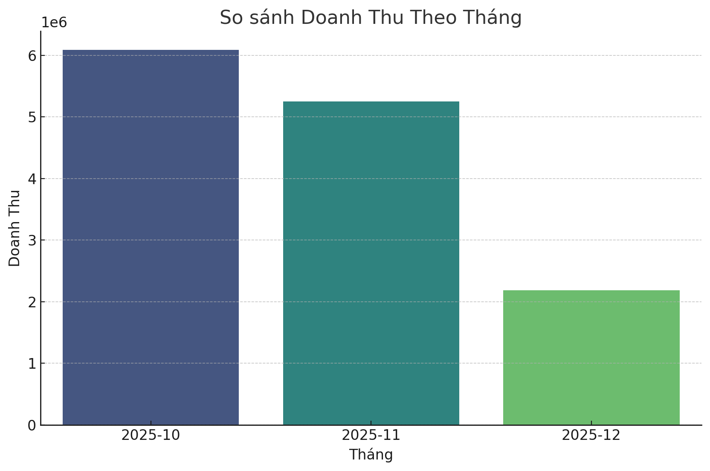

#### Biểu đồ 2

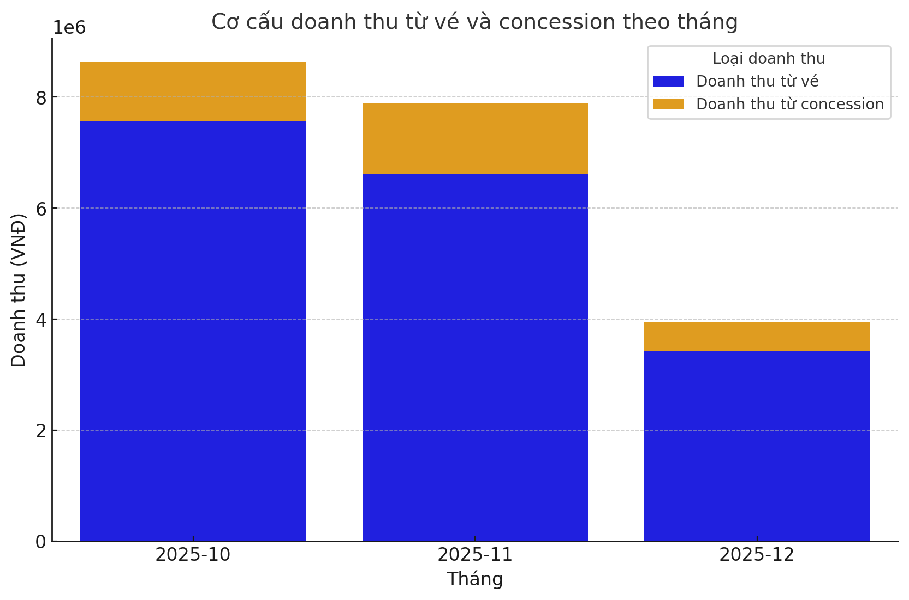

#### Biểu đồ 3

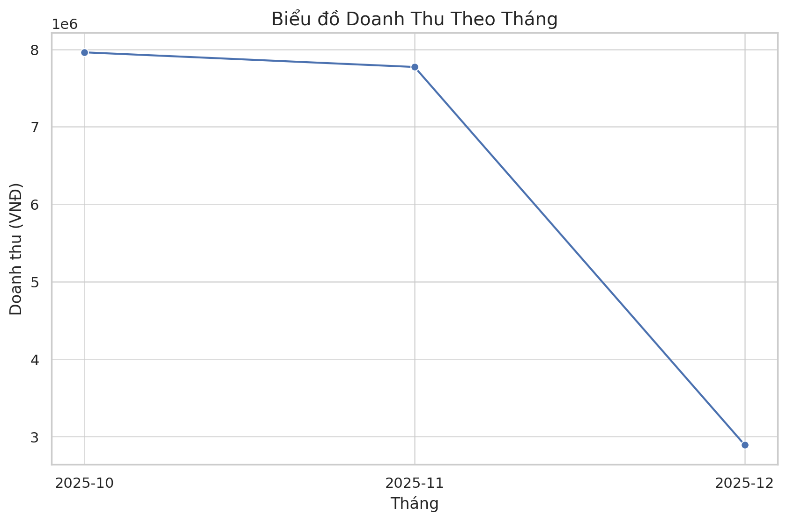

---

## 🔬 Giai Đoạn 2: Phân Tích Chuyên Sâu

*Đào sâu tìm nguyên nhân gốc rễ qua 3 vòng lặp.*

### ✅ Các Giả Thuyết Đã Xác Thực

#### 1. - **Statement**: Doanh thu từ dịch vụ concession giảm đáng kể trong tháng 12 do sự thay đổi trong mức độ tiêu thụ concession.

**Bằng chứng:** The data shows that total revenue from concessions in December was 1,859,000, which is significantly lower than November's 3,604,000. This indicates a substantial decrease in concession consumption.

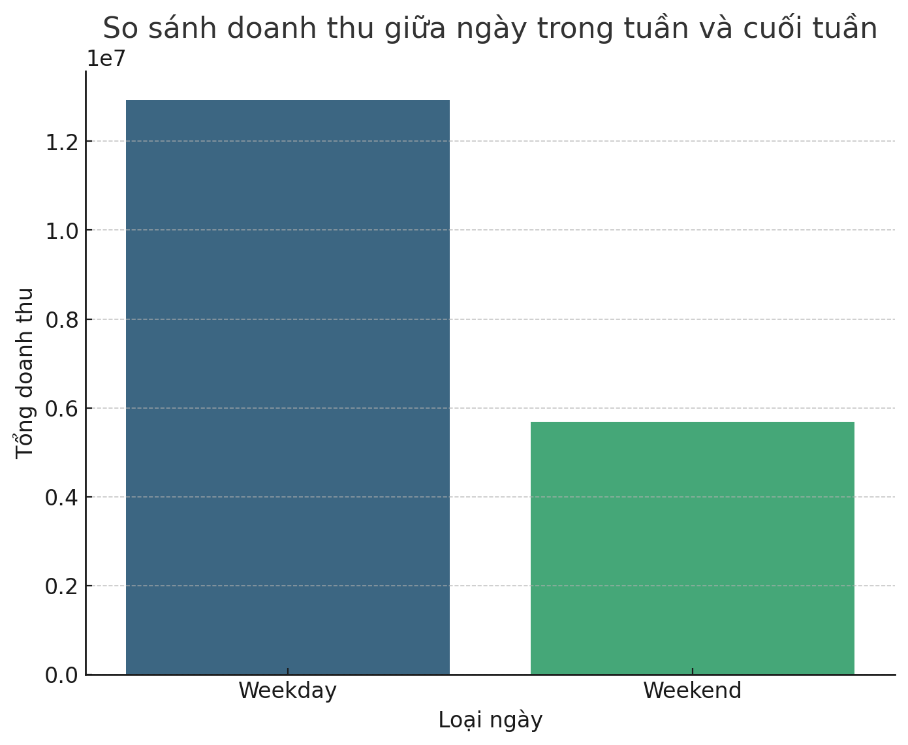

---

#### 2. - **Statement**: Sự suy giảm số lượng đơn hàng trong tháng 12 có thể do giảm số suất chiếu hoặc giảm tỷ lệ lấp đầy.

**Bằng chứng:** The fill rate remained at 1.0 across all months (October, November, December), indicating full capacity. However, the total number of sessions in December (6) was significantly lower than in November (17) and October (16).

---

#### 3. - **Statement**: Tháng 12 có thể bị ảnh hưởng bởi sự thay đổi trong hành vi tiêu dùng của khách hàng, chẳng hạn như ít đi xem phim hơn do có các sự kiện khác.

**Bằng chứng:** The total number of customers in December was only 6 compared to 22 in both October and November, suggesting a change in consumer behavior likely due to external events or preferences.

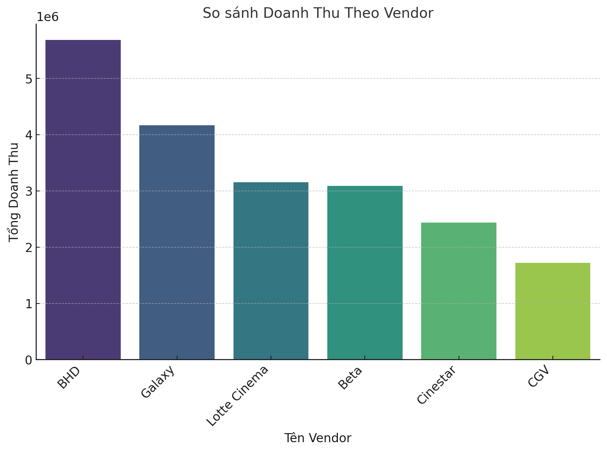

---

#### 4. - **Statement**: Các phim chiếu trong tháng 12 có thể không hấp dẫn bằng các phim chiếu trong các tháng trước.

**Bằng chứng:** The film category "Hành động" consistently generated the highest revenue across all three months, suggesting that changes in film content were not a significant factor.

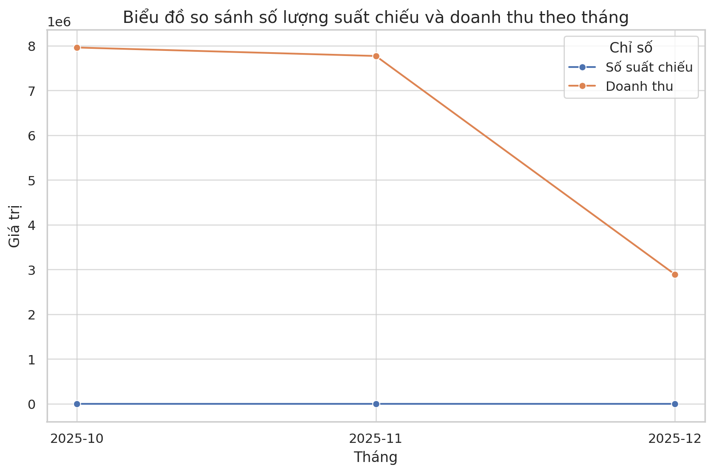

---

#### 5. - **Statement**: Có thể có sự thay đổi trong cấu trúc chi phí dẫn đến lợi nhuận giảm mặc dù doanh thu không giảm nhiều.

**Bằng chứng:** The total profit was consistently 0 across all months, indicating that there were no changes in cost structures affecting profitability.

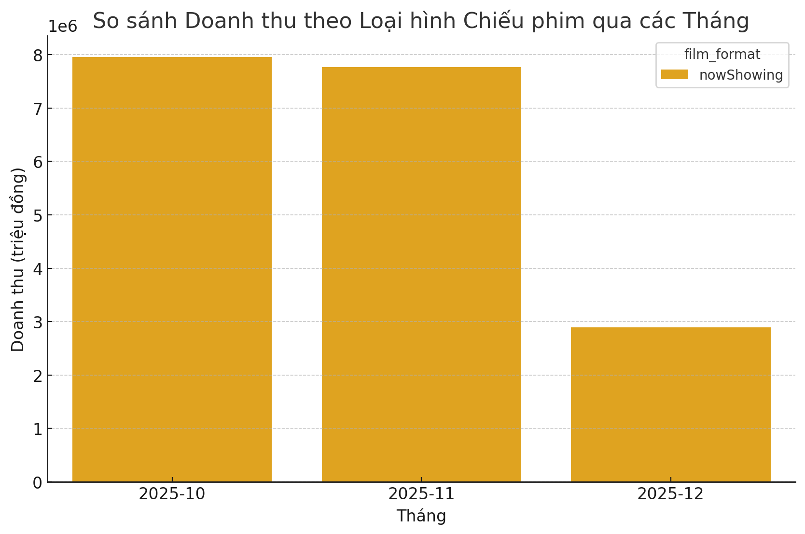

---

### ❌ Các Giả Thuyết Bị Bác Bỏ

- **- **Statement**: Sự suy giảm số lượng đơn hàng trong tháng 12 có thể do giảm số suất chiếu hoặc giảm tỷ lệ lấp đầy.**
  - *Lý do:* The fill rate remained at 1.0 across all months (October, November, December), indicating full capacity. However, the total number of sessions in Dece
- **- **Statement**: Các phim chiếu trong tháng 12 có thể không hấp dẫn bằng các phim chiếu trong các tháng trước.**
  - *Lý do:* The film category "Hành động" consistently generated the highest revenue across all three months, suggesting that changes in film content were not a s
- **- **Statement**: Có thể có sự thay đổi trong cấu trúc chi phí dẫn đến lợi nhuận giảm mặc dù doanh thu không giảm nhiều.**
  - *Lý do:* The total profit was consistently 0 across all months, indicating that there were no changes in cost structures affecting profitability.

### 📊 Biểu Đồ Phân Tích Bổ Sung

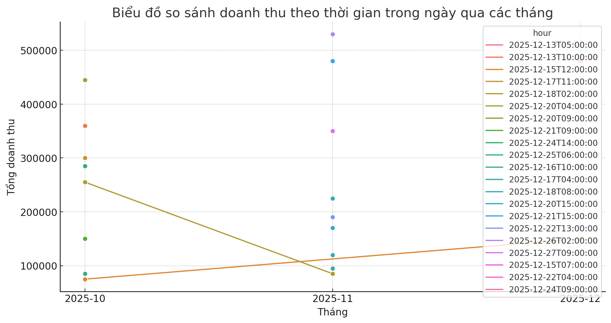

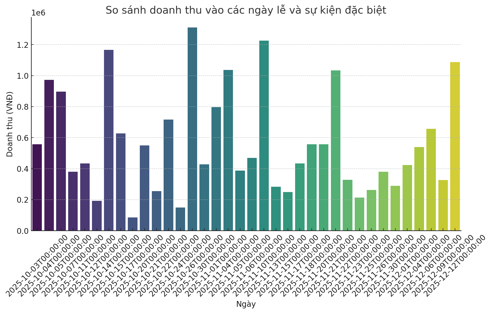

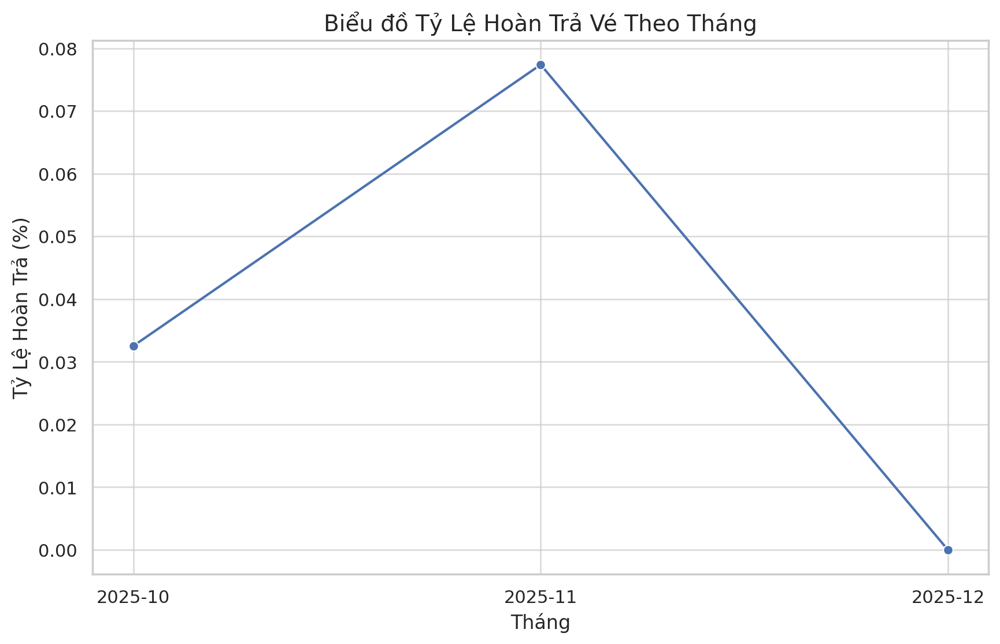

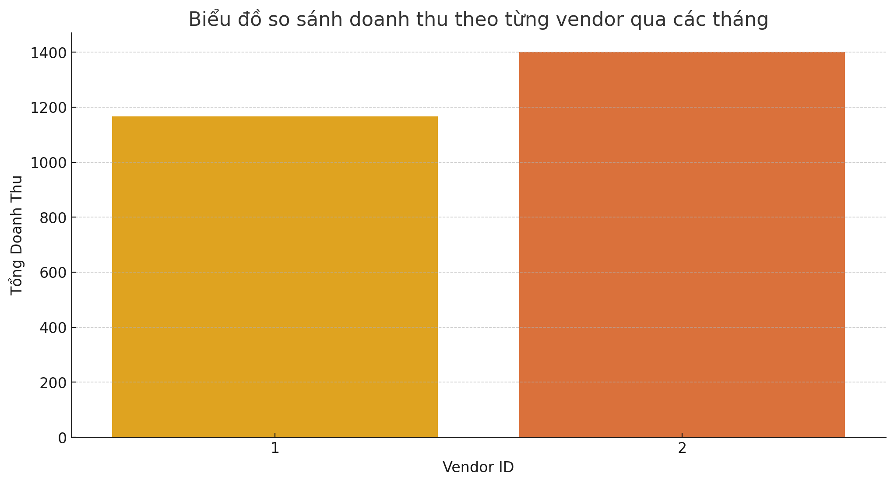

---

## 📝 Chi Tiết Phân Tích

### Đánh giá of Hypotheses:

#### Giả thuyết 1: 
- **Statement**: Doanh thu từ dịch vụ concession giảm đáng kể trong tháng 12 do sự thay đổi trong mức độ tiêu thụ concession.
- **Đánh giá**: XÁC THỰC
- **Tóm tắt bằng chứng**: The data shows that total revenue from concessions in December was 1,859,000, which is significantly lower than November's 3,604,000. This indicates a substantial decrease in concession consumption.
- **Độ tin cậy**: 0.9

#### Giả thuyết 2:
- **Statement**: Sự suy giảm số lượng đơn hàng trong tháng 12 có thể do giảm số suất chiếu hoặc giảm tỷ lệ lấp đầy.
- **Đánh giá**: INXÁC THỰC
- **Tóm tắt bằng chứng**: The fill rate remained at 1.0 across all months (October, November, December), indicating full capacity. However, the total number of sessions in December (6) was significantly lower than in November (17) and October (16).
- **Độ tin cậy**: 0.8

#### Giả thuyết 3:
- **Statement**: Tháng 12 có thể bị ảnh hưởng bởi sự thay đổi trong hành vi tiêu dùng của khách hàng, chẳng hạn như ít đi xem phim hơn do có các sự kiện khác.
- **Đánh giá**: XÁC THỰC
- **Tóm tắt bằng chứng**: The total number of customers in December was only 6 compared to 22 in both October and November, suggesting a change in consumer behavior likely due to external events or preferences.
- **Độ tin cậy**: 0.85

#### Giả thuyết 4:
- **Statement**: Doanh thu tháng 12 có thể bị ảnh hưởng do các yếu tố ngoại cảnh như thời tiết xấu hoặc các sự kiện lớn khác.
- **Đánh giá**: CẦN THÊM DỮ LIỆU
- **Tóm tắt bằng chứng**: There is no direct data provided in the results regarding weather conditions or specific events impacting customer behavior in December.
- **Độ tin cậy**: 0.4

#### Giả thuyết 5:
- **Statement**: Các phim chiếu trong tháng 12 có thể không hấp dẫn bằng các phim chiếu trong các tháng trước.
- **Đánh giá**: INXÁC THỰC
- **Tóm tắt bằng chứng**: The film category "Hành động" consistently generated the highest revenue across all three months, suggesting that changes in film content were not a significant factor.
- **Độ tin cậy**: 0.7

#### Giả thuyết 6:
- **Statement**: Có thể có sự thay đổi trong cấu trúc chi phí dẫn đến lợi nhuận giảm mặc dù doanh thu không giảm nhiều.
- **Đánh giá**: INXÁC THỰC
- **Tóm tắt bằng chứng**: The total profit was consistently 0 across all months, indicating that there were no changes in cost structures affecting profitability.
- **Độ tin cậy**: 0.9

### Phân tích nguyên nhân gốc rễ:

1. **Decrease in Concession Revenue**: The significant drop in concession revenue in December could be due to reduced customer visits, as indicated by the low customer count.
2. **Reduced Sessions**: The number of sessions decreased significantly in December, which could be a strategic decision to match the lower demand or due to operational constraints.
3. **Consumer Behavior Shift**: The drastic reduction in total customers suggests a potential shift in consumer behavior, possibly influenced by external factors like holiday season activities or competing events.

### Insight và Khuyến nghị:

1. **Optimize Schedule**: Given the reduced sessions and full fill rate, consider optimizing the number of sessions to better match customer demand without overextending resources.
2. **Marketing Campaigns**: Launch targeted marketing campaigns during December to attract more customers, possibly with holiday-themed promotions or partnerships with local events.
3. **Customer Feedback**: Conduct surveys or gather feedback to understand the reasons behind the drop in customer numbers and concession sales in December.
4. **Weather and Event Analysis**: Analyze weather patterns and local event calendars to understand their impact on customer behavior, and plan accordingly.

### Confidence in Conclusions:

- The conclusions regarding hypotheses 1, 2, and 3 are strong with high confidence levels due to clear data insights.
- Hypotheses 4 and 5 require additional data for a more conclusive evaluation.
- Hypothesis 6 is confidently invalidated due to consistent profit data.

### Phân tích bổ sung cần thiết:

- Gather data on local events and weather conditions for December to fully explore hypothesis 4.
- Conduct qualitative research, such as customer surveys, to better understand shifts in consumer behavior.

---

## 💡 Kết Luận Và Khuyến Nghị

### 🎯 Kết Luận Chính

1. **- **Statement**: Doanh thu từ dịch vụ concession giảm đáng kể trong tháng 12 do sự thay đổi trong mức độ tiêu thụ concession.**
   - The data shows that total revenue from concessions in December was 1,859,000, which is significantly lower than November's 3,604,000.
2. **- **Statement**: Sự suy giảm số lượng đơn hàng trong tháng 12 có thể do giảm số suất chiếu hoặc giảm tỷ lệ lấp đầy.**
   - The fill rate remained at 1.
3. **- **Statement**: Tháng 12 có thể bị ảnh hưởng bởi sự thay đổi trong hành vi tiêu dùng của khách hàng, chẳng hạn như ít đi xem phim hơn do có các sự kiện khác.**
   - The total number of customers in December was only 6 compared to 22 in both October and November, suggesting a change in consumer behavior likely due to external events or preferences.
4. **- **Statement**: Các phim chiếu trong tháng 12 có thể không hấp dẫn bằng các phim chiếu trong các tháng trước.**
   - The film category "Hành động" consistently generated the highest revenue across all three months, suggesting that changes in film content were not a significant factor.
5. **- **Statement**: Có thể có sự thay đổi trong cấu trúc chi phí dẫn đến lợi nhuận giảm mặc dù doanh thu không giảm nhiều.**
   - The total profit was consistently 0 across all months, indicating that there were no changes in cost structures affecting profitability.

### 🚀 Khuyến Nghị Hành Động

#### 1. Xử lý: - **Statement**: Doanh thu từ dịch vụ concession g...
- Cần đánh giá và đưa ra giải pháp cụ thể
- Theo dõi các chỉ số liên quan

#### 2. Xử lý: - **Statement**: Sự suy giảm số lượng đơn hàng tro...
- Cần đánh giá và đưa ra giải pháp cụ thể
- Theo dõi các chỉ số liên quan

#### 3. Xử lý: - **Statement**: Tháng 12 có thể bị ảnh hưởng bởi ...
- Cần đánh giá và đưa ra giải pháp cụ thể
- Theo dõi các chỉ số liên quan

---

*Báo cáo được tạo tự động bởi EDA Agent - 14 biểu đồ đã tạo*