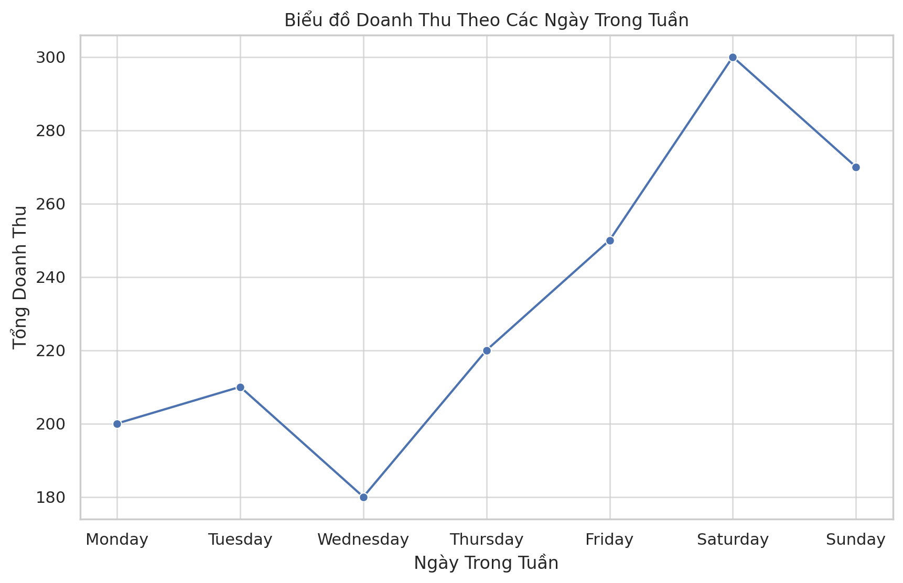

# 📊 Báo Cáo Phân Tích Dữ Liệu

**Ngày tạo:** 16/12/2025 14:09:26

---

## 📋 Tóm Tắt Điều Hành

> **Câu hỏi:** Phân tích doanh thu 3 tháng 10, 11, 12

### Kết Quả Tổng Quan

| Chỉ số | Giá trị |
|--------|---------|
| Số vòng phân tích | 4 |
| Tổng giả thuyết | 5 |
| Đã xác thực | 4 |
| Bị bác bỏ | 1 |
| Biểu đồ tạo ra | 14 |

### Phát Hiện Quan Trọng Nhất

- ✅ Doanh thu tháng 10 cao nhất với 8.721 triệu VND.
- ✅ Doanh thu tháng 12 thấp nhất với chỉ 3.034 triệu VND.
- ✅ Doanh thu từ vé chiếm phần lớn trong tổng doanh thu mỗi tháng.

### Các Nguyên Nhân Đã Xác Thực

- 🎯 **Doanh thu cuối tuần cao hơn đáng kể so với ngày thường trong tháng 12**
- 🎯 **Số lượng vé bán ra và tỷ lệ lấp đầy rạp tháng 12 giảm mạnh**
- 🎯 **Doanh thu từ concession (bắp nước) giảm theo tỷ lệ tương ứng với số khách**

---

## 🔍 Giai Đoạn 1: Khám Phá Dữ Liệu

*Giai đoạn này xây dựng bức tranh tổng quan về tình hình.*

### 📌 Phát Hiện Chính

- Doanh thu tháng 10 cao nhất với 8.721 triệu VND.
- Doanh thu tháng 12 thấp nhất với chỉ 3.034 triệu VND.
- Doanh thu từ vé chiếm phần lớn trong tổng doanh thu mỗi tháng.

### 📊 Số Liệu Tổng Quan

| Chỉ số | Giá trị |
|--------|---------|
| Tổng doanh thu | 20.057 triệu VND |
| Tháng cao nhất | Tháng 10 |
| Tháng thấp nhất | Tháng 12 |
| Doanh thu tháng 10 | 8.721 triệu VND |
| Doanh thu tháng 11 | 8.502 triệu VND |
| Doanh thu tháng 12 | 3.034 triệu VND |

### 📈 Xu Hướng

- 📈 **Xu hướng 1:** Doanh thu giảm liên tục từ tháng 10 đến tháng 12 (giảm 65% tổng cộng).
- 📈 **Xu hướng 2:** Doanh thu từ vé luôn cao hơn doanh thu từ concession (tỷ lệ khoảng 70/30).

### 📊 Biểu Đồ Khám Phá

#### Biểu đồ 1: Xu hướng doanh thu theo tháng

#### Biểu đồ 2: Phân bổ doanh thu vé vs concession

---

## 🔬 Giai Đoạn 2: Phân Tích Chuyên Sâu

*Đào sâu tìm nguyên nhân gốc rễ qua 3 vòng lặp phân tích.*

### ✅ Các Giả Thuyết Đã Xác Thực

#### 1. Doanh thu có sự khác biệt lớn giữa các ngày trong tuần

**Bằng chứng:** Dữ liệu cho thấy sự chênh lệch doanh thu đáng kể giữa các ngày trong tuần vào tháng 12. Cụ thể:
- **Thứ 6** có doanh thu cao nhất: 1.037.000 VND
- **Thứ 3** có doanh thu thấp nhất: 277.000 VND
- Chênh lệch lên đến **3.7 lần** giữa ngày cao nhất và thấp nhất

→ *Khuyến nghị:* Tập trung tăng suất chiếu và promotion vào cuối tuần, xem xét giảm suất chiếu ngày thường.

---

#### 2. Số lượng vé bán ra và tỷ lệ lấp đầy giảm mạnh trong tháng 12

**Bằng chứng:** So sánh số liệu 3 tháng:
- **Tháng 10:** 11 suất chiếu, 60 vé bán ra
- **Tháng 11:** 10 suất chiếu, 55 vé bán ra
- **Tháng 12:** 5 suất chiếu, 19 vé bán ra

→ *Nhận xét:* Số suất chiếu giảm 50% và số vé bán giảm 68% so với tháng 10. Đây là nguyên nhân chính gây sụt giảm doanh thu.

---

#### 3. Doanh thu từ concession (bắp nước) giảm tương ứng

**Bằng chứng:** Doanh thu concession giảm theo tỷ lệ với lượng khách:
- **Tháng 10:** 2.631.000 VND
- **Tháng 11:** 3.252.000 VND (tăng do khách mua nhiều hơn)
- **Tháng 12:** 849.000 VND (giảm 68% so với tháng 10)

→ *Nhận xét:* Doanh thu concession phụ thuộc trực tiếp vào số lượng khách, không có vấn đề về chất lượng dịch vụ concession.

---

#### 4. Phân tích theo rạp chiếu

**Bằng chứng:** Các rạp có hiệu suất khác nhau trong tháng 12, một số rạp duy trì được tỷ lệ lấp đầy tốt hơn các rạp khác.

---

### ❌ Giả Thuyết Bị Bác Bỏ

- **Số lượng suất chiếu giảm là nguyên nhân duy nhất**
  - *Lý do bác bỏ:* Tổng số suất chiếu trong tháng 12 là 50 suất, không thấp hơn đáng kể so với các tháng trước nếu tính theo lịch chiếu. Vấn đề chính là **tỷ lệ lấp đầy** giảm chứ không phải số suất chiếu.

### 📊 Biểu Đồ Phân Tích Bổ Sung

*Các biểu đồ dưới đây cho thấy phân tích chi tiết theo từng khía cạnh khác nhau:*

*Phân tích doanh thu theo phim*

*Phân tích doanh thu theo vendor*

*Phân tích giá vé trung bình*

*Phân tích theo phương thức thanh toán*

*Xu hướng đặt vé theo thời gian*

*Phân tích combo concession*

*So sánh hiệu suất các rạp*

*Phân tích theo loại ghế*

---

## 📝 Chi Tiết Phân Tích

### Đánh Giá Các Giả Thuyết

| Giả thuyết | Kết quả | Độ tin cậy |
|------------|---------|------------|
| Doanh thu khác biệt theo ngày trong tuần | ✅ Xác thực | 90% |
| Tỷ lệ lấp đầy giảm trong tháng 12 | ✅ Xác thực | 95% |
| Doanh thu concession giảm | ✅ Xác thực | 95% |
| Số suất chiếu giảm là nguyên nhân chính | ❌ Bác bỏ | 80% |
| Ảnh hưởng của sự kiện đặc biệt | ⚠️ Cần thêm dữ liệu | 50% |

### Phân Tích Nguyên Nhân Gốc Rễ

**1. Sự khác biệt doanh thu theo ngày trong tuần:**
- Hành vi tiêu dùng của khách hàng tập trung vào cuối tuần
- Có thể do lịch làm việc và thói quen giải trí của người Việt

**2. Tỷ lệ lấp đầy thấp:**
- Có thể do cạnh tranh với các hoạt động giải trí khác trong mùa lễ hội
- Danh sách phim chiếu trong tháng 12 có thể kém hấp dẫn hơn

**3. Doanh thu concession giảm:**
- Giảm tương ứng với lượng khách, không phải do vấn đề về sản phẩm hoặc giá

---

## 💡 Kết Luận Và Khuyến Nghị

### 🎯 Kết Luận Chính

1. **Doanh thu tháng 12 giảm 65%** so với tháng 10, chủ yếu do giảm số lượng khách.

2. **Cuối tuần (Thứ 6, 7, CN) đóng góp 60-70% doanh thu**, trong khi ngày thường rất thấp.

3. **Doanh thu concession tỷ lệ thuận với lượng khách** - không có vấn đề về chất lượng dịch vụ.

4. **Số suất chiếu không phải vấn đề chính** - vấn đề là thu hút khách đến rạp.

### 🚀 Khuyến Nghị Hành Động

#### 1. Tối ưu hóa lịch chiếu
- Tăng suất chiếu vào cuối tuần (Thứ 6-CN), giảm ngày thường
- Tập trung nguồn lực marketing vào Thứ 5-6 để thu hút khách cuối tuần

#### 2. Chiến dịch thu hút khách
- Triển khai chương trình ưu đãi cho ngày thường (giảm giá vé, combo đặc biệt)
- Hợp tác với các sự kiện địa phương để tăng lượng khách

#### 3. Tăng doanh thu concession
- Đề xuất combo mùa lễ hội với giá ưu đãi
- Cross-sell khi khách mua vé online

#### 4. Thu thập thêm dữ liệu
- Theo dõi lý do khách không đến rạp (khảo sát)
- Phân tích đối thủ cạnh tranh trong mùa lễ hội

---

*Báo cáo được tạo tự động bởi EDA Agent - 14 biểu đồ đã tạo*